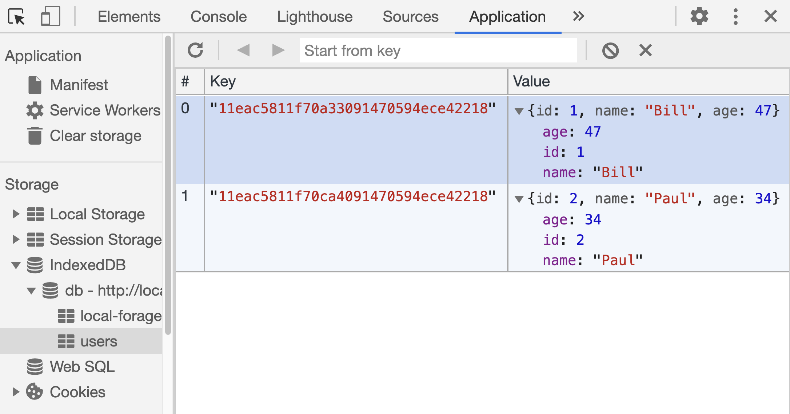
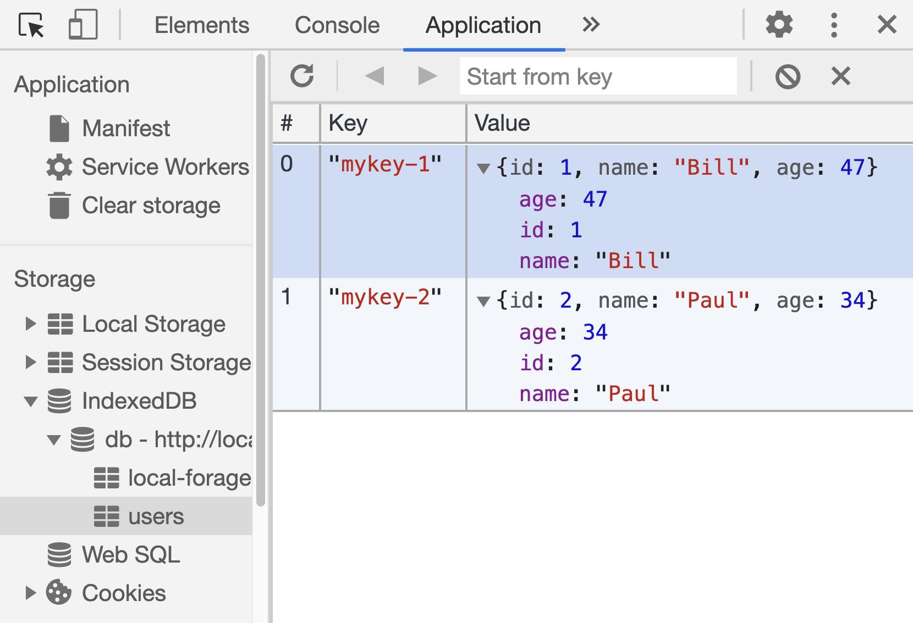
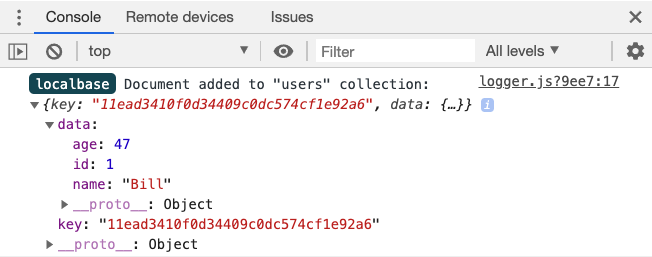

# Localbase <!-- omit in toc -->

A Firebase-Style Database ... Offline!

Localbase gives you an offline database with the simplicity & power of Firebase, all stored in the user's browser (in an IndexedDB database).

You can create as many databases as you like.

Databases are organised into Collections and Documents (just like Firebase Cloud Firestore).

- **Databases** contain **Collections** (e.g. `users`)
- **Collections** contain **Documents** (e.g. `{ id: 1, name: 'Bill', age: 47 }`

Localbase is built on top of [LocalForage](https://github.com/localForage/localForage).

## Contents <!-- omit in toc -->

- [Getting Started](#getting-started)
  - [Installation & Initialisation](#installation--initialisation)
    - [With a Script Tag](#with-a-script-tag)
    - [With NPM](#with-npm)
- [Video Introduction](#video-introduction)
- [Quick Start](#quick-start)
- [Adding Data](#adding-data)
  - [Add a document to a collection](#add-a-document-to-a-collection)
  - [Update a document](#update-a-document)
  - [Set a document (overwrite)](#set-a-document-overwrite)
  - [Set a collection (overwrite)](#set-a-collection-overwrite)
- [Getting Data](#getting-data)
  - [Get a collection](#get-a-collection)
  - [Order a collection](#order-a-collection)
  - [Limit a collection](#limit-a-collection)
  - [Get a document](#get-a-document)
- [Deleting Data](#deleting-data)
  - [Delete a document](#delete-a-document)
  - [Delete a collection](#delete-a-collection)
  - [Delete a database](#delete-a-database)
- [Advanced Usage with Keys](#advanced-usage-with-keys)
  - [Add a document & specify your own key](#add-a-document--specify-your-own-key)
  - [Set a collection (overwrite) including keys](#set-a-collection-overwrite-including-keys)
  - [Get, Update, Set or Delete a Document by key (instead of by document criteria)](#get-update-set-or-delete-a-document-by-key-instead-of-by-document-criteria)
  - [Get a Collection and return the keys along with the data.](#get-a-collection-and-return-the-keys-along-with-the-data)
- [Promises](#promises)
  - [Add Document then do something](#add-document-then-do-something)
  - [Update Document then do something](#update-document-then-do-something)
  - [Set Document then do something](#set-document-then-do-something)
  - [Delete Document then do something](#delete-document-then-do-something)
  - [Delete Collection then do something](#delete-collection-then-do-something)
  - [Delete Database then do something](#delete-database-then-do-something)
- [Async / Await](#async--await)
  - [Add Documents (with Async Await)](#add-documents-with-async-await)
  - [Update Document (with Async Await)](#update-document-with-async-await)
  - [Set Document (with Async Await)](#set-document-with-async-await)
  - [Get Collection & Catch Errors (with Async Await)](#get-collection--catch-errors-with-async-await)
- [Configuration](#configuration)
  - [Disable the Gorgeous Logs](#disable-the-gorgeous-logs)
- [Localbase Playground](#localbase-playground)


## Getting Started

### Installation & Initialisation

#### With a Script Tag
```html
<script src="https://unpkg.com/localbase/dist/localbase.dev.js"></script>

<script>
  let db = new Localbase('db')
</script>
```

Or, use the minified, production version:
```html
<script src="https://unpkg.com/localbase/dist/localbase.min.js"></script>

<script>
  let db = new Localbase('db')
</script>
```


#### With NPM

```
npm install localbase --save
```

```javascript
import Localbase from 'localbase'

let db = new Localbase('db')
```

## Video Introduction

<a href="https://www.youtube.com/watch?v=KJnupY2HPCg" target="_blank">Watch my Video Introduction to Localbase</a>, including how to get started:

<a href="https://www.youtube.com/watch?v=KJnupY2HPCg" target="_blank">
  
</a>

## Quick Start

Get started by adding a document to a collection. Just specify the collection name with the `collection` method (the collection will be created automatically) then specify the document you want to add with the `add` method: 
```javascript
db.collection('users').add({
  id: 1,
  name: 'Bill',
  age: 47
})
```
Simples!

Once you've added some data to a collection, you can get the whole collection with the `get` method:
```javascript
db.collection('users').get().then(users => {
  console.log(users)
})

//  [
//    { id: 1, name: 'Bill', age: 47 },
//    { id: 2, name: 'Paul', age: 34 }
//  ]
```

## Adding Data

### Add a document to a collection

Add a new document to a collection.

```javascript
db.collection('users').add({
  id: 1,
  name: 'Bill',
  age: 47
})
```

### Update a document

Update an existing document. Just pass an object with a field and value (usually id) to match the document. Then pass in only the fields you want to update with the `update` method.

```javascript
db.collection('users').doc({ id: 1 }).update({
  name: 'William'
})

//  [
//    { id: 1, name: 'William', age: 47 },
//    { id: 2, name: 'Paul', age: 34 }
//  ]
```

**Note:** if more than one document is matched by your criteria e.g `.doc({ gender: 'male' })` then **all** matched documents will be updated. 

### Set a document (overwrite)

Overwrite an existing document. This will completely overwrite the selected document, so all required fields should be passed into the `set` method.

```javascript
db.collection('users').doc({ id: 2 }).set({
  id: 4, 
  name: 'Pauline',
  age: 27
})

//  [
//    { id: 1, name: 'William', age: 47 },
//    { id: 4, name: 'Pauline', age: 27 }
//  ]
```

**Note:** if more than one document is matched by your criteria e.g `.doc({ gender: 'male' })` then **all** matched documents will be overwritten. 

### Set a collection (overwrite)

Overwrite an entire collection with an array of documents. This will completely overwrite the selected collection.

```javascript
db.collection('users')
  .set([
    {
      id: 1,
      name: 'Bill',
      age: 48
    },
    {
      id: 2, 
      name: 'Paul',
      age: 28
    }
  ])

//  [
//    { id: 1, name: 'Bill', age: 48 },
//    { id: 2, name: 'Paul', age: 28 }
//  ]
```

## Getting Data

### Get a collection

Get all items from a collection. The collection will be returned in an array.

```javascript
db.collection('users').get().then(users => {
  console.log(users)
})

//  [
//    { id: 1, name: 'Bill', age: 47 },
//    { id: 2, name: 'Paul', age: 34 }
//  ]
```

### Order a collection

Get a collection and order it by a particular field (ascending).

```javascript
db.collection('users').orderBy('age').get().then(users => {
  console.log('users: ', users)
})

//  [
//    { id: 2, name: 'Paul', age: 34 },
//    { id: 1, name: 'Bill', age: 47 }
//  ]
```

Get a collection and order it by a particular field (descending).

```javascript
db.collection('users').orderBy('name', 'desc').get().then(users => {
  console.log('users: ', users)
})

//  [
//    { id: 2, name: 'Paul', age: 34 },
//    { id: 1, name: 'Bill', age: 47 }
//  ]
```

### Limit a collection

Order a collection & limit it to a particular number of documents.

```javascript
db.collection('users').orderBy('name', 'desc').limit(1).get().then(users => {
  console.log('users: ', users)
})

//  [
//    { id: 2, name: 'Paul', age: 34 }
//  ]
```


### Get a document

Get an individual document from a collection

```javascript
db.collection('users').doc({ id: 1 }).get().then(document => {
  console.log(document)
})

// { id: 1, name: 'Bill', age: 47 }
```

## Deleting Data

### Delete a document
Delete a document from a collection.
```javascript
db.collection('users').doc({ id: 1 }).delete()

//  [
//    { id: 2, name: 'Paul', age: 34 }
//  ]
```

**Note:** if more than one document is matched by your criteria e.g `.doc({ gender: 'male' })` then **all** matched documents will be deleted. 

### Delete a collection
Delete a collection and all documents contained in it.
```javascript
db.collection('users').delete()
```

### Delete a database
Delete a database and all collections contained in it.
```javascript
db.delete()
```

## Advanced Usage with Keys

Your documents are stored in an IndexedDB store with keys:



By default, Localbase generates random, ordered, unique IDs for these keys.

But you might want to take control of these keys. For example, you might want to:
- Specify your own key when you add a document
- Use the key for selecting a document (when getting, updating, setting or deleting a document) instead of using some document criteria
- Return all of the keys as well as the document fields, when getting a collection, e.g.
```javascript
[
  {
    key: 'mykey-2',
    data: {
      { id: 2, name: 'Paul', age: 34 }
    }
  },
  {
    key: 'mykey-1',
    data: {
      { id: 1, name: 'Bill', age: 47 }
    }
  }
]
```

You can do all this with Localbase:

### Add a document & specify your own key

After specifying your document data, pass in a key (to be used by the IndexedDB store) as a second parameter:

```javascript
db.collection('users').add({
  id: 1,
  name: 'Bill',
  age: 47
}, 'mykey-1')
```

Or, you can just use the `set` method:

```javascript
db.collection('users').doc('mykey-1').set({
  id: 1, 
  name: 'Bill',
  age: 47
})
```

Which would look like this in the IndexedDB:



### Set a collection (overwrite) including keys

Overwrite an entire collection with an array of documents, and specify a key for each document. Make sure you pass in the `{ keys: true }` option. This will completely overwrite the selected collection.

```javascript
db.collection('users')
  .set([
    {
      id: 1,
      name: 'Bill',
      age: 48,
      _key: 'mykey-1'
    },
    {
      id: 2, 
      name: 'Paul',
      age: 28,
      _key: 'mykey-2'
    }
  ], { keys: true })
```

### Get, Update, Set or Delete a Document by key (instead of by document criteria)

When selecting a document with the `doc` method, instead of passing in an object with a field name and value, just pass in a string (or integer) with your key:
```javascript
// get document by key
db.collection('users').doc('mykey-1').get().then(document => {
  console.log(document)
})

// update document by key
db.collection('users').doc('mykey-1').update({
  name: 'William'
})

// set document by key
db.collection('users').doc('mykey-2').set({
  id: 4, 
  name: 'Pauline',
  age: 27
})

// delete a document by key
db.collection('users').doc('mykey-1').delete()
```


### Get a Collection and return the keys along with the data.

When getting a collection, just pass `{ keys: true }` into the `get` method:

```javascript
db.collection('users').orderBy('name', 'desc').get({ keys: true }).then(users => {
  console.log('users: ', users)
})

//  [
//    {
//      key: 'mykey-2',
//      data: {
//        { id: 2, name: 'Paul', age: 34 }
//      }
//    },
//    {
//      key: 'mykey-1',
//      data: {
//        { id: 1, name: 'Bill', age: 47 }
//      }
//    }
//  ]
```

## Promises

You can add promises to all operations and do something when it's successful, or when there's an error.

### Add Document then do something

```javascript
db.collection('users')
  .add({
    id: 1,
    name: 'Bill',
    age: 47
  }, 'mykey-1')
  .then(response => {
    console.log('Add successful, now do something.')
  })
  .catch(error => {
    console.log('There was an error, do something else.')
  })

// you can test the error by passing a 
// string, number or boolean into the 
// .add() method, instead of an object
```

### Update Document then do something

```javascript
db.collection('users')
  .doc({ id: 1 })
  .update({
    name: 'William'
  })
  .then(response => {
    console.log('Update successful, now do something.')
  })
  .catch(error => {
    console.log('There was an error, do something else.')
  })
  
// you can test the error by passing nothing
// into the update() method
```

### Set Document then do something

```javascript
db.collection('users')
  .doc({ id: 1 })
  .set({
    id: 1, 
    name: 'Pauline',
    age: 27
  })
  .then(response => {
    console.log('Set successful, now do something.')
  })
  .catch(error => {
    console.log('There was an error, do something else.')
  })

// you can test the error by passing nothing
// into the set() method
```

### Delete Document then do something

```javascript
db.collection('users')
  .doc({ id: 1 })
  .delete()
  .then(response => {
    console.log('Delete successful, now do something.')
  })
  .catch(error => {
    console.log('There was an error, do something else.')
  })

  // you can test the error by passing nothing
  // into the doc() method
```

### Delete Collection then do something

```javascript
db.collection('users')
  .delete()
  .then(response => {
    console.log('Collection deleted, now do something.')
  })
  .catch(error => {
    console.log('There was an error, do something else')
  })
  
// you can test the error by passing nothing
// into the collection() method
```

### Delete Database then do something

```javascript
db.delete()
  .then(response => {
    console.log('Database deleted, now do something.')
  })
  .catch(error => {
    console.log('There was an error, do something else.')
  })
  
// note: sometimes when you delete a
// database, the change won't show up
// in Chrome Dev tools til you reload
// the page
```

## Async / Await

You can also use Async / Await with all operations

### Add Documents (with Async Await)

```javascript
async function addUsers() {
  await db.collection('users').add({
    id: 1,
    name: 'Bill',
    age: 47
  })
  console.log('first user added')
  await db.collection('users').add({
    id: 2,
    name: 'Paul',
    age: 34
  })
  console.log('second user added')
}
addUsers()
```

### Update Document (with Async Await)

```javascript
async function updateUser() {
  let result = await db.collection('users')
    .doc({ id: 1 })
    .update({
      name: 'William'
    })
  console.log(result)
}
updateUser()
```

### Set Document (with Async Await)

```javascript
async function setUser() {
  let result = await db.collection('users')
    .doc({ id: 2 })
    .set({
      id: 4, 
      name: 'Pauline',
      age: 27
    })
    console.log(result)
}
setUser()
```

### Get Collection & Catch Errors (with Async Await)

```javascript
async function getUsers() {
  try {
    let users = await db.collection('users')
      .orderBy('age')
      .get()
    console.log('users: ', users)
  }
  catch(error) {
    console.log('error: ', error)
  }
}
getUsers()

// test the error by passing nothing into collection()
```

## Configuration

### Disable the Gorgeous Logs

By default, when in development, Localbase will fire out gorgeously labelled debug logs like this:



You can disable these logs by setting `db.config.debug` to `false`.

It's best to do this after you initialize the database, and before you do anything else:
```javascript
import Localbase from 'localbase'
let db = new Localbase('db')

db.config.debug = false

// now do some stuff with the motherflipping db yo
```


## Localbase Playground

[Localbase Playground](https://github.com/dannyconnell/localbase-playground) is an app for playing around with Localbase and all the available methods.

It contains a bunch of different code snippets (for adding, updating, setting and getting) data to/from a Localbase database.

You can launch these code snippets (and edit them if you like) in the browser and observe the result in the IndexedDB database and in the console.


[Localbase Playground and launch instructions](https://github.com/dannyconnell/localbase-playground)